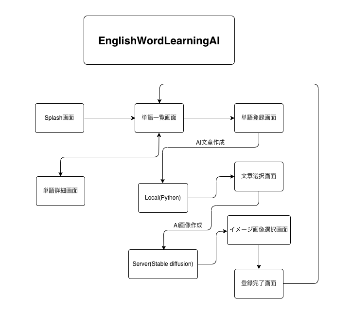

# EnglishWordLearningAI

## 概要
#### AI単語帳アプリ
##### ユーザーが入力した文章を英文に変換させ、それを元に画像生成を行う。選択された画像と文章をセットにして登録し、オリジナルの生成画像付き英単語帳が作成できる。

## アプリ画面 
#### 実機起動

|ホーム/単語一覧画面|英文生成画面|文章選択画面|イメージ選択画面|登録完了画面|単語詳細画面|
|-|-|-|-|-|-|
|  |  |  |  |  |  |

## 参考資料
### サーバー制作
- 開発言語
  -  Python
- 使用環境
  - AWS, Lambda, API Gateway, Bedrock, S3
- 画像生成
  -  [参考サイト]([https://www.fsi.co.jp/blog/8843/](https://aws.amazon.com/jp/builders-flash/202402/bedrock-image-generation/?awsf.filter-name=*all))
- 例文生成
  - [参考サイト](https://qiita.com/miso_taku/items/0b495b75d669556621b5)

### システム設計
- 開発言語
  -  SwiftUI

